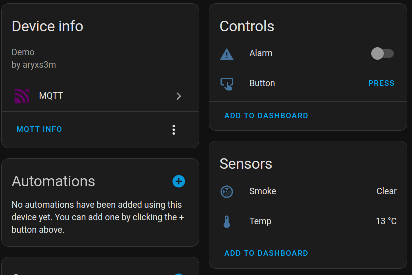

# Home Assistant - Laravel integration

With this simple package you can create Home Assistant devices and entities (via MQTT).

You can achieve two-way communication with your Home Assistant instance: publish sensors that produce data for
your Home Assistant instance, or publish switches which you can change in Home Assistant and modify your Laravel app's
behavior.

**Currently supported entity types:**

- binary sensor
- sensor
- button
- switch

## Installing

Install via composer:

```shell
composer install aryxs3m/laravel-hoas
```

Publish config:

```shell
php artisan vendor:publish --provider="Aryxs3m\LaravelHoas\Providers\HomeAssistantProvider"
```

Fill up `config/hoas.php` with your MQTT broker's parameters or use the predefined environment variables. See the config
file.

## Usage

First, you need to create your device and it's entities.

### Create devices and entities

**Switch entity example:**

```php
<?php

namespace App\HomeAssistant;

use Aryxs3m\LaravelHoas\Services\Entities\HomeAssistantSwitch;use Illuminate\Support\Facades\Log;

class TestSwitch extends HomeAssistantSwitch
{
    protected static string $id = 'test_switch';
    protected ?string $icon = 'mdi:alert';
    protected ?string $friendlyName = 'Alarm';

    public function onTurnOn(): void
    {
        Log::info('Test switch turned on!!!');
    }

    public function onTurnOff(): void
    {
        Log::info('Test switch turned off... :|');
    }
}
```

**Button** example:

```php
<?php

namespace App\HomeAssistant;

use Aryxs3m\LaravelHoas\Services\Entities\HomeAssistantButton;use Illuminate\Support\Facades\Log;

class TestButton extends HomeAssistantButton
{
    protected static string $id = 'test_btn';
    protected ?string $friendlyName = 'Button';

    public function onPress(): void
    {
        Log::info('Test button pressed!');
    }
}
```

**Binary Sensor** example:

```php
<?php

namespace App\HomeAssistant;

use Aryxs3m\LaravelHoas\Services\Entities\HomeAssistantBinarySensor;use Aryxs3m\LaravelHoas\Services\Entities\Types\BinarySensorDeviceClass;

class TestBinarySensor extends HomeAssistantBinarySensor
{
    protected static string $id = 'test_smoke';
    protected ?string $friendlyName = 'Smoke';
    protected ?string $deviceClass = BinarySensorDeviceClass::DEVICE_CLASS_SMOKE;
}
```

**Sensor** example:

```php
<?php

namespace App\HomeAssistant;

use Aryxs3m\LaravelHoas\Services\Entities\HomeAssistantSensor;use Aryxs3m\LaravelHoas\Services\Entities\Types\SensorDeviceClass;

class TestSensor extends HomeAssistantSensor
{
    protected static string $id = 'test_sensor';
    protected ?string $friendlyName = 'Temp';
    protected ?string $deviceClass = SensorDeviceClass::TEMPERATURE;
    protected ?string $measurementUnit = '°C';
}
```

**Device** example:

```php
<?php

namespace App\HomeAssistant;

use Aryxs3m\LaravelHoas\Services\Entities\HomeAssistantDevice;

class TestDevice extends HomeAssistantDevice
{
    protected string $id = 'test_device';
    protected string $name = 'Test Device';
    protected ?string $manufacturer = 'aryxs3m';
    protected ?string $model = 'Example';

    public function getEntities(): array
    {
        return [
            new TestButton(),
            new TestSwitch(),
            new TestBinarySensor(),
            new TestSensor(),
        ];
    }
}
```

Now you need to set up this device in your `AppServiceProvider`:

```php
// ...

/**
 * Bootstrap any application services.
 */
public function boot(): void
{
    HomeAssistant::setDevices([
        new TestDevice(),
    ]);
}
```

### Use entities

#### Switches

You can add `onTurnOn` and `onTurnOff` functions to your switch class, as seen in the example above.
These functions will be called when the state changed from Home Assistant.

On switches, you can also use the `isTurnedOn` static function anywhere in your application:

```php
if (TestSwitch::isTurnedOn()) {
    dd("Yeah, i'm turned on ;)")
}
```

#### Buttons

Similar to switches, you can implement the `onPress` function in your button class. This function will be called when
the button is pressed in Home Assistant.

See the example above.

#### Binary Sensors

For binary sensors, you can use static helper functions anywhere in your application.

```php
TestBinarySensor::turnOn();
TestBinarySensor::turnOff();

dd(TestBinarySensor::isOn());
```

#### Sensors

Static helpers available for generic sensors too.

```php
TestSensor::set(13);
dd(TestSensor::get());
```

### Publishing your devices

Your devices will be automatically published if Laravel scheduler is configured.

However, for testing, you can always publish your devices to see the changes instantly with the `hoas:publish` Artisan
command.

The example from above looks like this:



### Listen to events

Configuring [Laravel command scheduling](https://laravel.com/docs/10.x/scheduling) is **required** for this package to
work. This package does everything else for you.

The scheduler calls the `hoas:listener` command every minute. This command receives the MQTT messages from Home
Assistant. Also, this command publishes your devices and entities.
